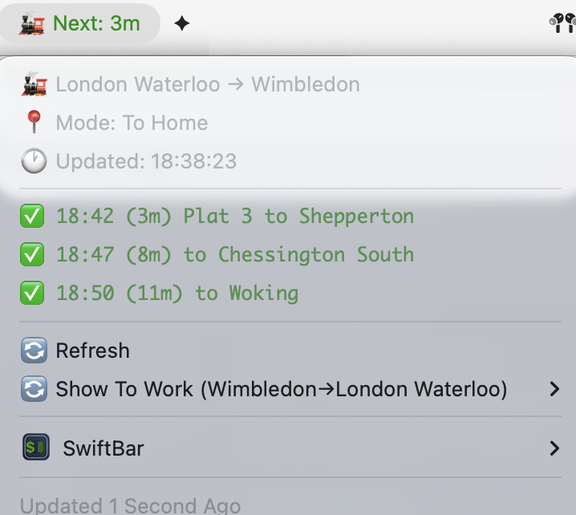

# UK Next Train - SwiftBar/xbar Plugin

A SwiftBar/xbar plugin that displays real-time UK train departure information with intelligent commuter mode switching.



## Features

- **Smart Commuter Mode**: Automatically switches between "to work" and "to home" routes based on time of day
- **Real-time Data**: Uses National Rail data via Huxley2 API (no credentials required)
- **Next Train Focus**: Shows the most urgent next train in the menu bar
- **Status-Based Color Coding**: Red for cancelled next train, orange for issues in later trains, green for all clear
- **Platform Information**: Optional platform and operator display
- **Quick Switch**: Easy toggle between directions in auto mode
- **Dark Mode Support**: Adapts colors for macOS dark mode

## Installation

1. Install [SwiftBar](https://swiftbar.app/) or [xbar](https://xbarapp.com/)
2. Download `uk_next_train.5m.py` to your plugins folder
3. Make it executable: `chmod +x uk_next_train.5m.py`
4. Configure your stations in SwiftBar preferences

## Configuration

The plugin supports these preferences (configurable via SwiftBar):

- **Home/Work Station**: Auto mode stations (default: WIM/WAT)  
- **Switch Time**: Time to change from to-work to to-home (default: 12:00)
- **Mode**: `auto` for smart switching or `manual` for fixed route
- **Train Count**: Number of trains to show (default: 3)
- **Show Platform**: Display platform information (default: true)
- **Show Operator**: Display train operator (default: false)

## Station Codes

Common UK station codes:
- **WAT**: Waterloo
- **WIM**: Wimbledon
- **LBG**: London Bridge
- **VIC**: Victoria
- **CHX**: Charing Cross
- **PAD**: Paddington
- **KGX**: Kings Cross
- **EUS**: Euston
- **LST**: Liverpool Street

## How It Works

### Auto Mode (Recommended)
- **Morning**: Shows home → work trains (e.g., Wimbledon → Waterloo)
- **Evening**: Shows work → home trains (e.g., Waterloo → Wimbledon)
- **Switch Time**: Customizable time when direction changes (default: 12:00)

### Manual Mode
- Always shows the specified from → to route
- Useful for non-commuters or irregular schedules

## Sample Output

**Menu Bar**: `🚂 Next: 5m` (color indicates overall train status)

**Dropdown Menu**:
```
🚂 Wimbledon → London Waterloo
📍 Mode: Manual (Home→Work) | color=gray
🕐 Updated: 08:51:34 | color=gray
---
✅ 08:54 (2m) Plat 5 to London Waterloo | color=red font=Monaco
✅ 09:02 (10m) Plat 5 to London Waterloo | color=orange font=Monaco
✅ 09:05 (13m) Plat 5 to London Waterloo | color=orange font=Monaco
---
```

## Color Coding

### Menu Bar Icon (🚂)
- **🚂 + Red**: Next train is cancelled
- **🚂 + Orange**: Any train apart from the next is not on time (delayed or cancelled)
- **🚂 + Green**: All trains have no issues (all on time)

### Train Status Icons
- **✅**: On time
- **⏰**: Delayed
- **❌**: Cancelled

## Data Source

Uses the free [Huxley2 API](https://huxley2.azurewebsites.net/) which provides real-time National Rail data without requiring API credentials.

## Requirements

- macOS with SwiftBar or xbar
- Python 3 (built into macOS)
- Internet connection

## Privacy

- No personal data collected
- No API keys required
- Only accesses public National Rail data
- All processing done locally

## Support

For issues or feature requests, please visit the [GitHub repository](https://github.com/vechiato/uk-next-train).

## License

MIT License - feel free to modify and share!